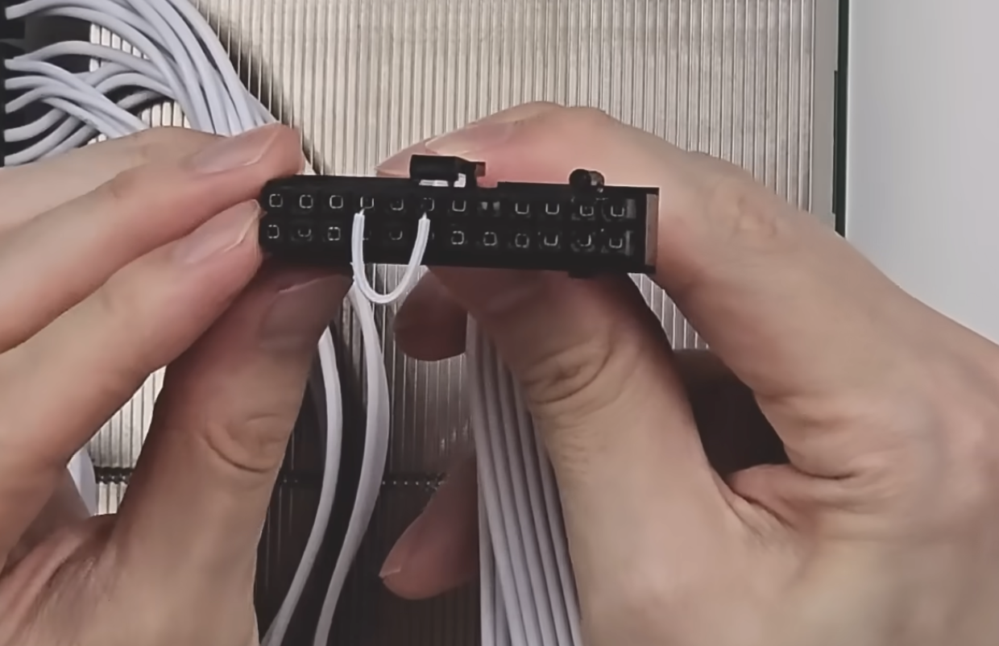

---
tags:
  - platform:bc250
---

# 구매 가이드

BC-250 보드 하나만 있다고 바로 쓸 수 있는 게 아니라, 전원 공급과 저장장치, 방열판 고정용 부자재까지 함께 준비해야 합니다. 이 문서에서는 무엇을 사야 하는지, 왜 필요한지, 대략적인 예산을 정리합니다.

## 1. 준비물

- **BC-250 보드**: 이 가이드의 핵심 하드웨어입니다. 중고 채굴 보드로 유통되며, 개별 모듈 상태(팬/히트싱크 미포함)로 판매되는 경우가 많습니다.
- **클립 (24핀 쇼트용)**: BC-250은 메인보드 없이 파워서플라이만으로 8핀 전원을 공급받아 구동합니다. 파워서플라이는 24핀 커넥터가 메인보드에 물려 신호를 받아야 켜지므로, 24핀 커넥터의 16번 핀과 18번 핀을 클립으로 쇼트시켜 강제로 전원을 켜줘야 합니다.

    { width="400" }

    사진처럼 16번 핀과 18번 핀을 클립으로 연결해야 8핀 케이블에 전원이 인가됩니다.

- **파워서플라이 (8핀 PCIe 단자, 300W 이상, 당근마켓 중고 2~3만원대)**: BC-250은 8핀 PCIe 커넥터로 12V 전원을 입력받습니다. 여유 있는 구동을 위해 정격 300W 이상의 ATX 파워서플라이를 준비합니다.
- **NVMe SSD (당근마켓 중고 4~5만원대)**: 리눅스 설치 및 부팅용 저장장치입니다. 보드에 M.2 NVMe 슬롯이 있어 장착할 수 있습니다.
- **쿨러**: BC-250은 팬/히트싱크가 없는 상태로 판매되어서 별도의 쿨러가 필요합니다. **Arctic P12 Pro**를 추천합니다. (제일 많이 사용합니다.)
- **케이스**: 정식 케이스가 없어도 구동 자체에는 문제없지만, 쿨링및 미관상의 문제로 케이스가 있는 편이 좋습니다. 다양한 옵션이 있지만, 가성비로는 [다이소의 해당 케이스](https://www.daisomall.co.kr/pd/pdr/SCR_PDR_0001?pdNo=1051646&srsltid=AfmBOorg-oQ_GD_fPCgRunIvP1EOyuEdU_vGaxT_-p7mLHqpDNdd6H9o)를 쿨러와 함께 케이블 타이로 묶어 고정하는 방법을 추천합니다.
