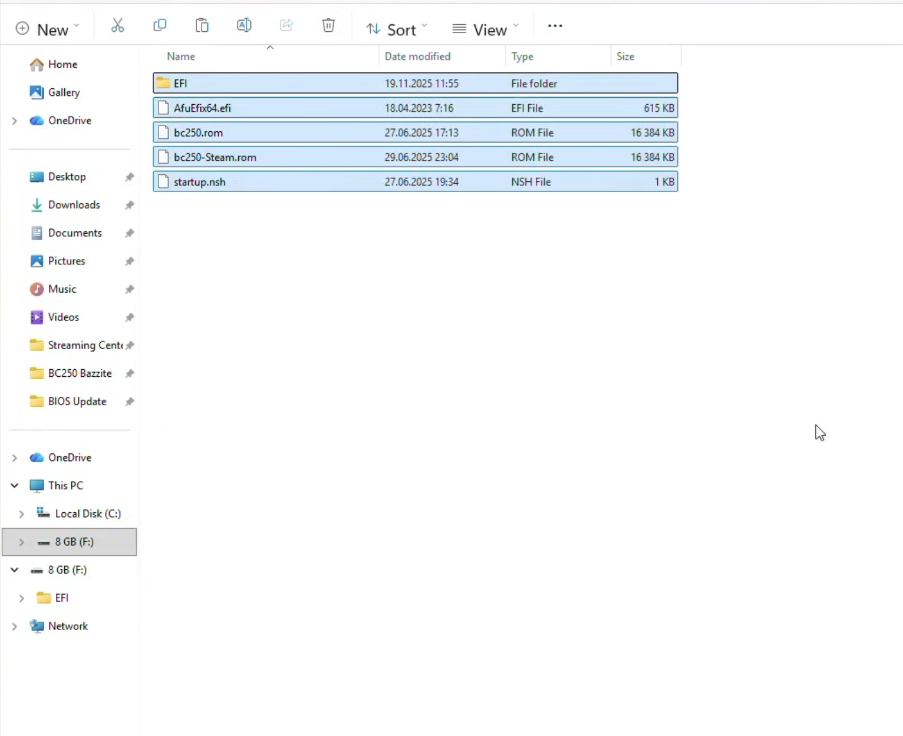
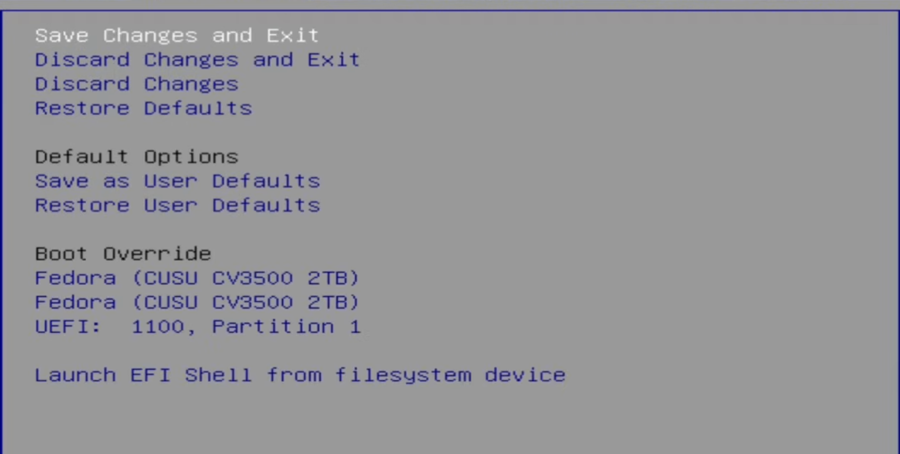
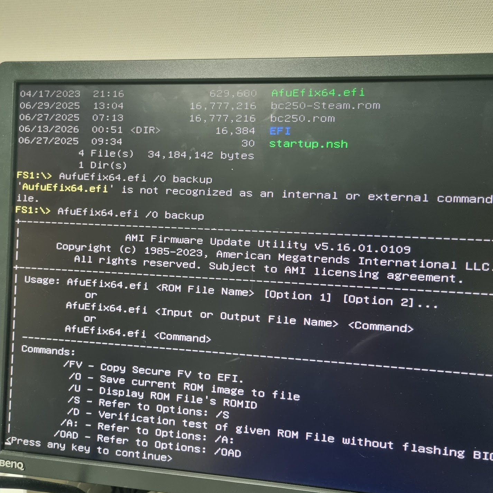
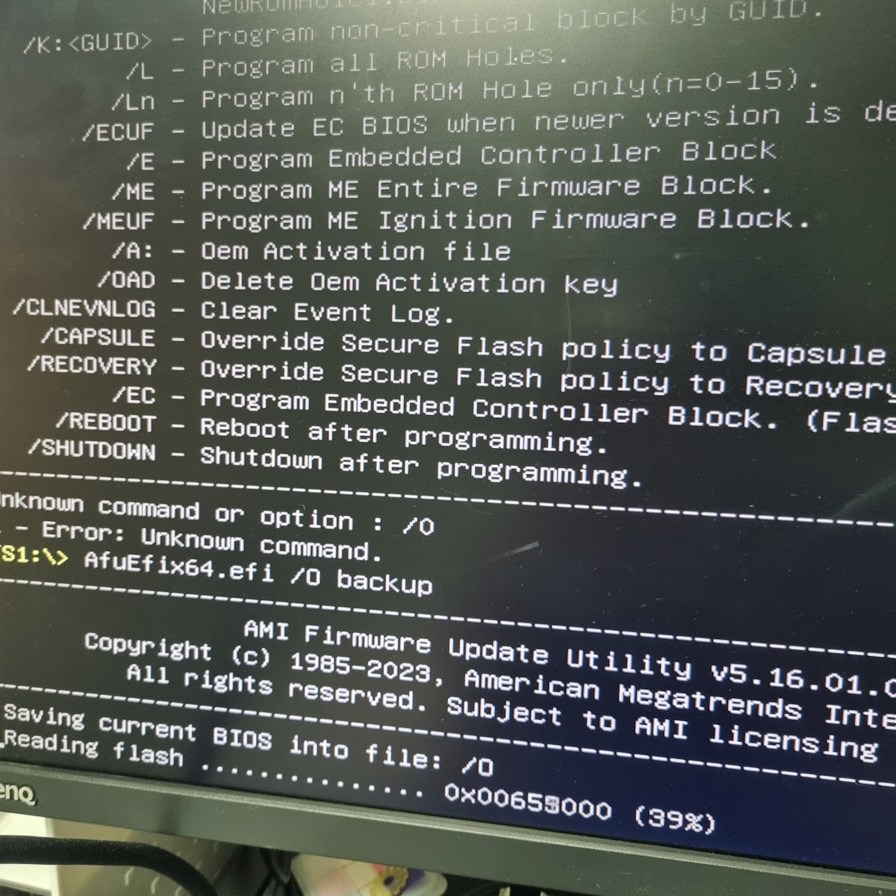
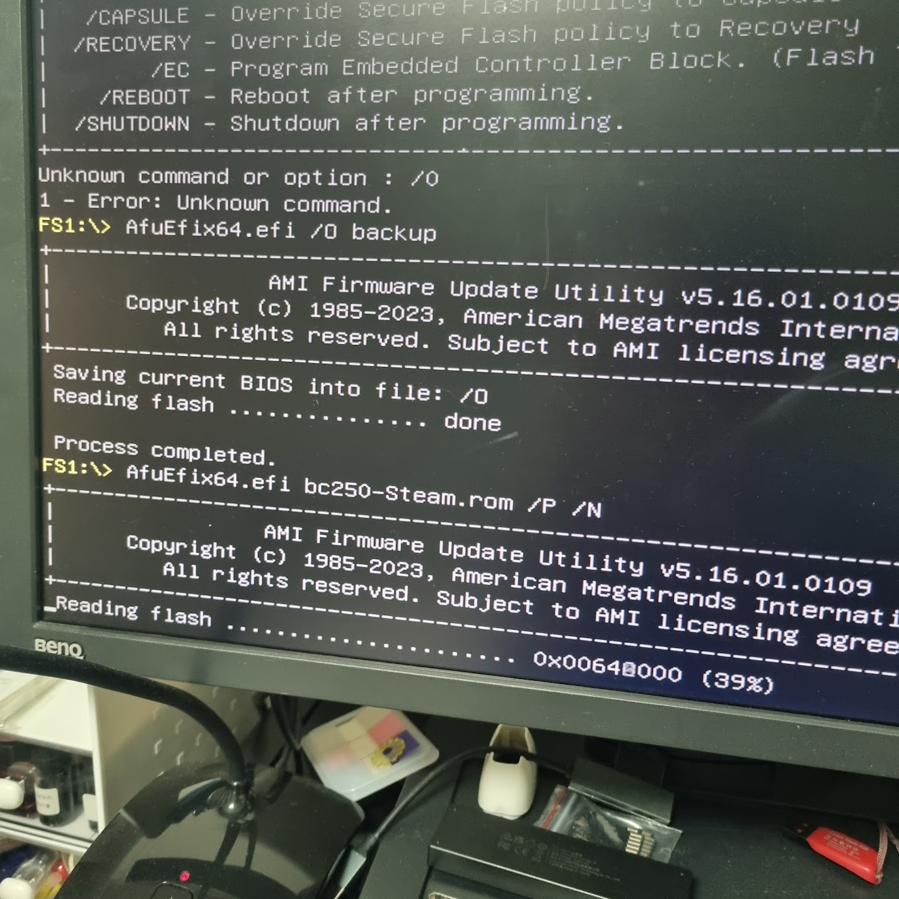
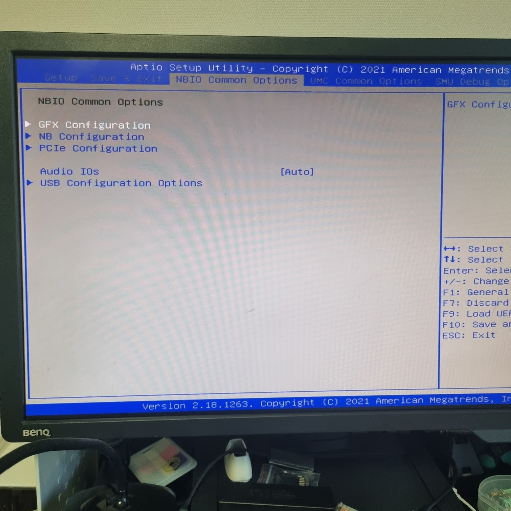
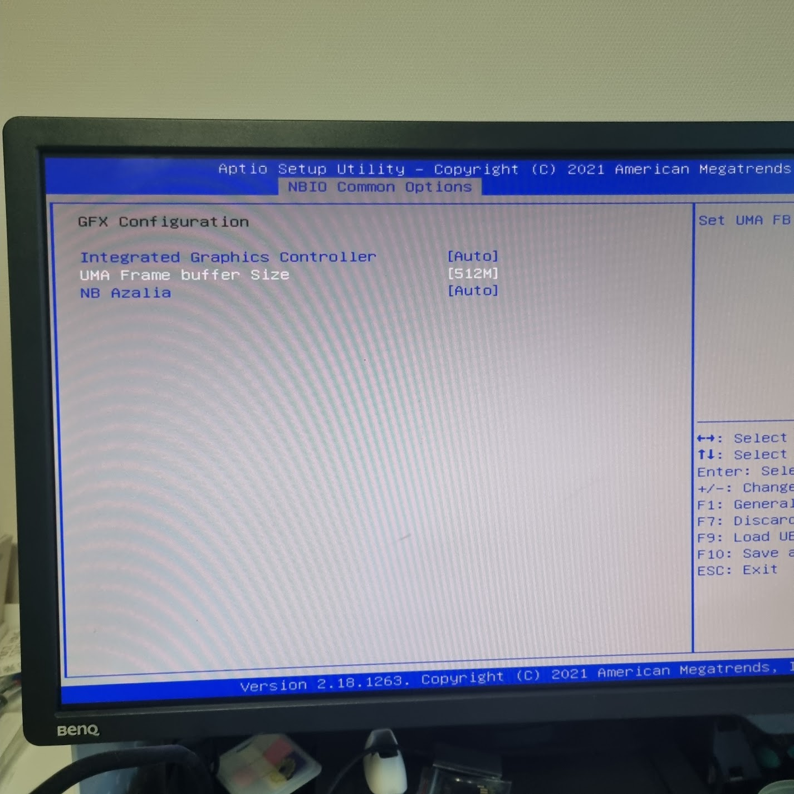

---
tags:
  - platform:bc250
---

# 하드웨어 설정 가이드

BIOS 언락, IOMMU 비활성화 등 이후 모든 문서에서 공통으로 전제하는 하드웨어/펌웨어 설정을 정리합니다.

## 1. 준비물

작업 전에 아래 도구와 부품을 미리 챙겨둡니다.

FAT32 로 포맷된 USB(BIOS 언락 및 리눅스 설치용 - 16GB 이상준비)

[BIOS 파일 다운로드(구글드라이브)](https://drive.google.com/file/d/1l-cuMn5bWQ622l_IUSxO8WqE9mo5U7bj/view?usp=drive_link){ .md-button }

## 2. BIOS 언락

<iframe style="width:100%; max-width:560px; aspect-ratio:16/9; height:auto;"
  src="https://www.youtube.com/embed/dieD-CuBQr0"
  title="YouTube video player" frameborder="0"
  allow="accelerometer; autoplay; clipboard-write; encrypted-media; gyroscope; picture-in-picture; web-share"
  referrerpolicy="strict-origin-when-cross-origin" allowfullscreen></iframe>
  참고영상

{ width="400" }

**FAT32 포맷 후** 파일에 있는 바이오스 파일을 넣습니다. 

{ width="400" }

USB를 꼽아주시고 부팅 시 DEL 키를 눌러 바이오스 진입 후 SAVE & EXIT 메뉴에서 `Launch EFI Shell from filesystem device` 를 눌러 UEFI 셸에 진입합니다.

{ width="400" }

셸 진입 후 `dir` 입력하여 USB에 파일이 잘 저장됐는지 확인 후,
`AfuEfix64.efi /O backup` (알파벳 대문자 O) 입력하여 순정 바이오스 롬 추출 및 백업 진행합니다.

{ width="400" }

`AfuEfix64.efi  bc250-steam.rom /P /N` 입력 후 완료되면 스팀로고가 뜹니다. DEL 키 연타

{ width="500" }

## 3. Vram 설정

CMOS 화면에서 Vram을 할당합니다.

{ width="500" }

NBIO Common Opions 설정창에서 `GFX configuration` 클릭

{ width="500" }

`UMA Frame buffer Size` 선택 후 512M 로 설정해줍니다. 나머지 용량은 시스템이 유동적으로 할당하게 됩니다.
